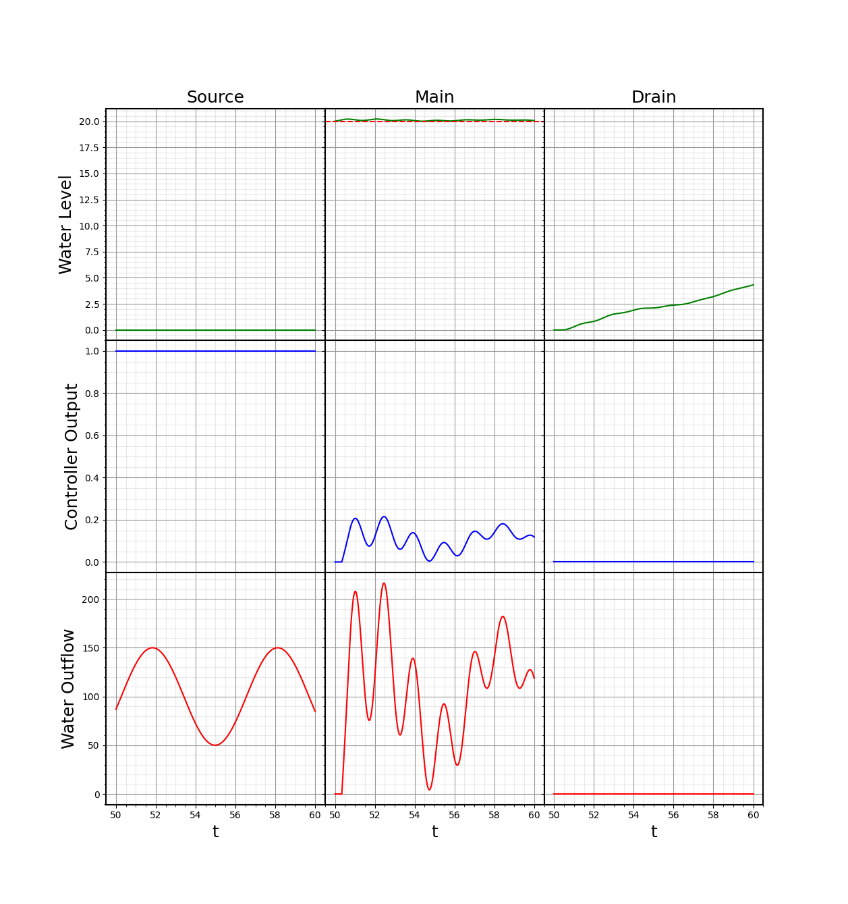

# vcontrol

A library to simulate and control dynamical systems of coupled vessels.

## Install
```shell script
pip install git+https://github.com/tsmcalister/vcontrol.git
```

## Example


```python
import numpy as np
import vcontrol; vcontrol.reset()

from vcontrol.vessels import Vessel, SourceVessel
from vcontrol.controllers import PIDController, FixedController

# Init proportional controller
pid = PIDController(p=1,
                    target_value=20,
                    inverse=True)

# Create vessel graph
source_vessel = SourceVessel(flow_t=lambda t: np.sin(t) * 50 + 100)
main_vessel = Vessel(source=source_vessel,
                     drain_control=pid,
                     name='Main')
drain_vessel = Vessel(source=main_vessel,
                      drain_control=FixedController.constant_controller(output=0),
                      name='Drain')

# connect PID "sensor" with a delay of 35*dt
pid.connect(lambda: main_vessel.get_height(delay=35))

# Simulate system to time 100 with dt=0.01
vcontrol.simulate(100, dt=0.01)

# plot results
fig, axs = vcontrol.plot(time_range=(50, 60))
fig.show()
```

### Output


